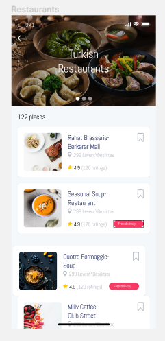
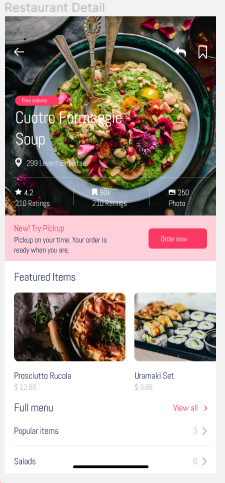
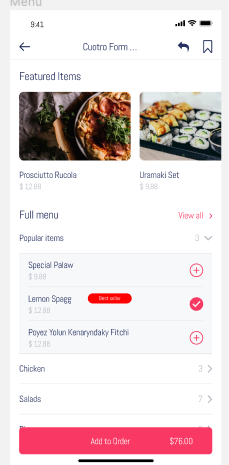

# FOOD-ORDER-CONCEPT
*Following already drawn design od the Figma I have created HTML pages for browser. This is design for food ordering application.*
## How to start project
* `git clone https://github.com/JelenaJ16/food-order-concept`
* You can see food pages by opening index.html, food.html and foodmenu.html.
## Technologies
1. HTML
2. TailwindCSS
3. CSS
## Development 
1. WebStorm
2. GitHub
3. Figma
### Desired state

[Figma design link](https://www.figma.com/file/4TpPRqLhTUIenhrV91knbR/food-order-app-aman-ilyasovich?node-id=0%3A1)

